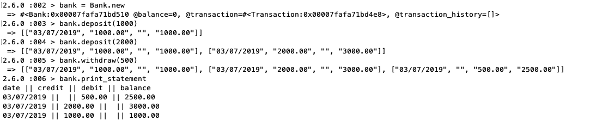

[](https://codeclimate.com/github/codeclimate/codeclimate/test_coverage) [](https://codeclimate.com/github/codeclimate/codeclimate/maintainability)

# The Task

Create a programme that can output a user's bank statement to interact with via a REPL. The focus of this challenge is to apply the best practises, including clean code, TDD and progress documentation. The full challenge specification is in this repo's wiki here. 

## Setup Instructions

To use this programme, in the computer's terminal, run:

```
- git clone git@github.com:fetc90/bank_tech_test.git
- cd bank
- bundle install
- IRB
- require './lib/bank.rb'
```
## To Use Programme

Create an account:
```
bank = Bank.new
``` 
Make a desposit:
```
bank.deposit(1000)
bank.deposit(2000)
``` 
Make a withdrawal:
```
bank.withdrawal(500)
``` 
Print bank statement:
```
bank.print_statement
``` 




## Testing Instructions

This programme is written in Ruby and tested with RSpec and Timecop. To ensure high code quality, I used Rubocop as a linter, Simplecov for test coverage and Code Climate for readability, which checks things like variable naming.


To see this project's tests and the test coverage, run in the computer's terminal:
 
```
- Fork/Clone this repo
- cd bank
- bundle install  
- Rspec
```

# My Process

Here is an overview of how my programme works


If you are interested in reading about this project in more detail, visit this repo's wiki to find: 

* The Specification
* My Process
* My Refactor Process
* Brief summary of how the programme works behind the scenes. 